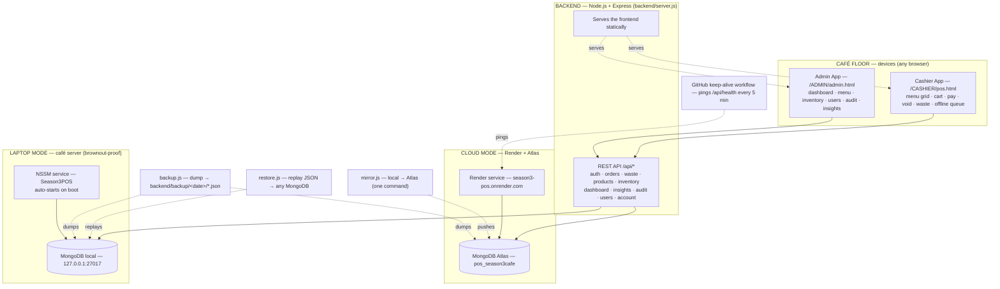
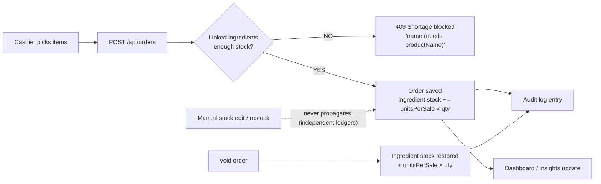
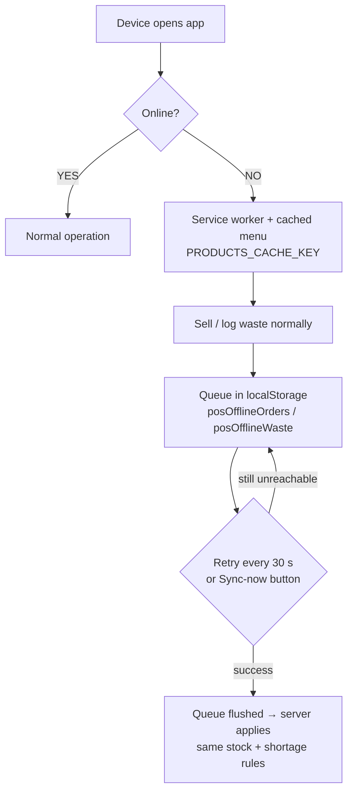
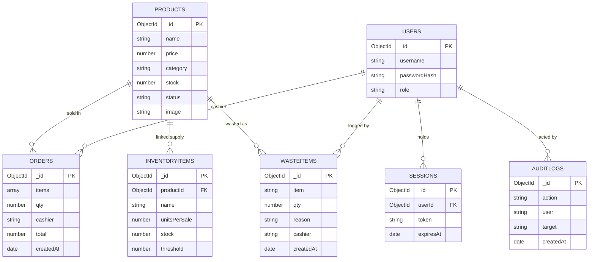
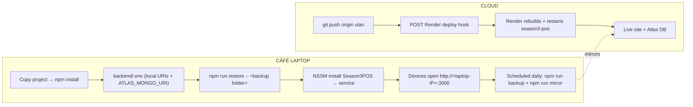

# Season 3 POS — System Workflow

> These diagrams are Mermaid — they render as images on GitHub, in VS Code
> (extension: *Markdown Preview Mermaid Support*), and on mermaid.live
> (paste the code, download PNG).

## 1. System architecture

## 2. Order lifecycle (ingredient ledger)

## 3. Offline flow (per device)

## 4. Database schema (MongoDB — 7 collections)

## 5. Deployment

